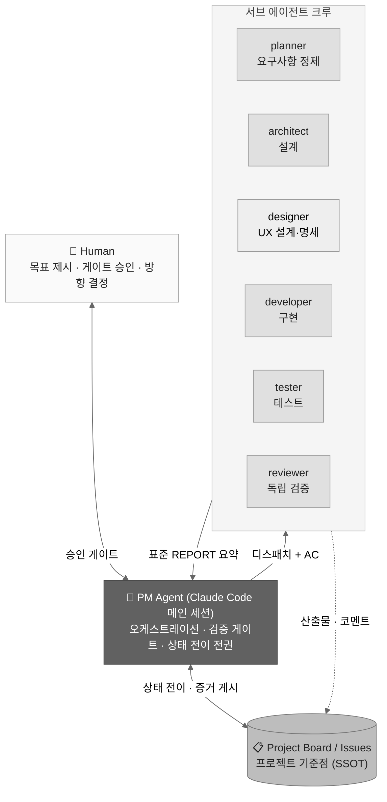

# 🎯 Crewboard

<p align="left">
  
  
  
  
  
</p>

> **A PM agent that runs your project board — with a crew of specialized subagents doing the work.**
>
> Claude Code 위에서 동작하는 멀티 에이전트 프로젝트 수행 체계.
> PM 에이전트가 GitHub Projects 또는 GitLab 이슈 보드를 프로젝트 현황의 기준점(SSOT)으로 삼아 오케스트레이션하고,
> 기획 → 설계 → 구현 → 테스트 전 단계를 전문화된 서브 에이전트가 수행합니다.

---

## 💡 어떻게 시작하나

Crewboard는 설치할 패키지가 없습니다. 설계 문서 한 장([CREWBOARD.md](CREWBOARD.md))을
새 프로젝트 폴더에 복사하고 Claude Code에게 부트스트랩을 지시하면, PM 에이전트와
서브 에이전트 크루, 보드 연동, 가드레일까지 프로젝트 수행 체계 전체가 구성됩니다.

```text
CREWBOARD.md 복사  →  claude 실행 (Opus급 모델)  →  "부트스트랩 프로토콜대로 구성해"  →  /kickoff
```

이후에는 PM 에이전트가 이슈 보드를 기준점 삼아 기획 → 설계 → 구현 → 테스트를
오케스트레이션하고, 사람은 요구사항 작성과 6개의 승인 게이트에서만 개입합니다.
단계별 절차는 [시작하기](#-시작하기)를 참고하세요.

## 🏗️ 아키텍처



핵심 제약을 그대로 설계에 반영했습니다: Claude Code의 서브에이전트는 다른
서브에이전트를 스폰할 수 없으므로, **PM은 메인 세션 그 자체**입니다.
서브에이전트는 요약만 보고하고 상세 산출물은 파일과 이슈 코멘트로 외부화하여
PM의 컨텍스트를 보호합니다.

## 🧭 설계 원칙

Crewboard의 모든 구성은 다섯 가지 원칙 위에 서 있습니다.

- **요구사항의 원천은 인테이크 파일** — 사람이 작성한 인테이크 파일이 모든 FR의 시작점입니다. 에이전트는 정제·구조화·검증만 합니다
- **보드가 SSOT** — 상태·산출물·결정이 모두 이슈 보드에 남습니다. 세션이 끊겨도 보드를 읽으면 어디서든 재개됩니다
- **구현자와 검증자를 분리** — builder–validator 원칙. AC 대조를 통과해야만 상태가 전이됩니다
- **제약은 권한으로 강제** — push·머지·보드 조작은 설정과 훅으로 차단합니다. 프롬프트 지시로는 막지 않습니다
- **회고를 스킬로 적재** — 검증된 해법을 skills/learned/에 저장해 다음 프로젝트에서 재사용합니다

> **SSOT** (Single Source of Truth): 프로젝트 현황의 유일한 기준점. 보드만 보면 누가 무엇을 하고 있는지, 어떤 결정이 내려졌는지 파악할 수 있어야 한다는 원칙.

## ✨ 주요 구성 요소

| 구성 | 내용 |
|------|------|
| **에이전트 7종** | planner / architect / **designer**(프론트 조건부) / developer / tester / reviewer / doc-writer — 절차·산출물 예시·안티패턴·에스컬레이션 조건을 갖춘 7요소 표준 정의 |
| **프로젝트 프로파일** | 스택·규약·환경 제약은 에이전트 정의가 아닌 프로파일에 — 같은 `.claude/` 세트를 어떤 스택의 프로젝트에도 재사용. 킥오프 때 프로파일에 맞는 스택 스킬을 확정·자동 생성 |
| **요구사항 인테이크** | 템플릿 발급 → 사람 작성 → RFI 질문 루프 → 베이스라인 → 마일스톤 분할(사이징 3원칙). 상세 AC와 이슈는 활성 마일스톤 단위 점진 생성(rolling-wave). R-ID 부터 코드까지 끊기지 않는 추적성 |
| **슬래시 커맨드 8종** | `/kickoff` `/intake` `/plan-sprint` `/run` `/verify` `/status` `/retro` `/guide` |
| **검증 게이트** | reviewer의 근거 인용 판정 + tester의 독립 시나리오 + PM의 기계적 대조. 재작업 3회 시 자동 에스컬레이션 |
| **가드레일** | push/merge 권한 차단, 보드 조작 훅 통제, CODEOWNERS로 `.claude/` 변경은 사람 리뷰 강제 |
| **자기개선 루프** | `/retro` 가 검증된 해법을 `skills/learned/` 에 적재 — [agentskills.io](https://agentskills.io) 호환 |

## 🚀 시작하기

### 요구 사항

- [Claude Code](https://code.claude.com/docs) 설치 및 인증
- `gh` CLI (GitHub) 또는 `glab` CLI (GitLab) — 자가 호스팅(GHE / self-managed) 지원
- 권장 모델: Claude Code 기본 모델(Opus급) 이상 — 부트스트랩·PM 세션 공통.
  창의성보다 긴 문서에 대한 지시 충실도가 중요한 체계라, 그 이하 모델은 항목 누락 위험이 있습니다

### 부트스트랩 (3단계)

```bash
# 1. 새 프로젝트 폴더에 가이드 문서를 복사
mkdir my-project && cd my-project
cp /path/to/CREWBOARD.md .

# 2. Claude Code 실행
claude
```
 
```text
# 3. Claude 에게 지시
> 이 문서의 부트스트랩 프로토콜대로 프로젝트를 구성해
```

Claude가 환경 점검 → 질문(플랫폼·리포지토리·보드) → 28개 항목 생성 →
보드/라벨 구성 → 검증 체크리스트 보고까지 자동으로 수행합니다.
구성이 끝나면 새 세션에서 프로젝트를 시작합니다:

```text
> /kickoff 사내 교육 신청 관리 시스템 — 신청/승인/이수 관리
```

### 전체 진행 시나리오

> **👤 사람이 직접** · **🤖 PM·에이전트 자동** · **🔑 게이트 — 사람 승인 없이 다음으로 넘어가지 않음**

```text
─── 세트업 (프로젝트당 1회) ──────────────────────────────────────────
👤  새 프로젝트 폴더에 CREWBOARD.md 복사 후 claude 실행
👤  "> 이 문서의 부트스트랩 프로토콜대로 구성해"
🤖  환경 점검 → 플랫폼·리포 질문 → 28개 파일 생성 → 보드·라벨 구성

─── Phase 0  착수 ────────────────────────────────────────────────────
👤  > /kickoff 사내 교육 신청 관리 시스템 — 신청/승인/이수 관리
🤖  프로파일 인터뷰 8항목 대화 (스택·환경·규약·일정 등)
🤖  스택 스킬 생성 → 헌장 초안 작성
🔑  게이트 1: 프로파일 승인       🔑  게이트 2: 헌장 승인
🤖  인테이크 템플릿 발급 ──────────────────────── ⏸ 사람 작성 대기

─── Phase 1  요구사항 ────────────────────────────────────────────────
👤  INTAKE-교육시스템.md 편집 (현업 협의 포함 — 며칠 걸려도 됨)
👤  > /intake
🤖  회수·박제 → planner 정제 → RFI 질문서 작성
👤  RFI 답변 (필요한 만큼 왕복)
🔑  게이트 3: 요구사항 베이스라인 확정
🤖  마일스톤 분할안 제시 (사이징 3원칙 적용)
🔑  게이트 4: 마일스톤 분할 승인
🤖  보드에 마일스톤 골격 + 첫 마일스톤 백로그 이슈 생성 (rolling-wave)

─── Phase 2  설계  (마일스톤마다) ───────────────────────────────────
🤖  planner: 이번 마일스톤 FR 상세 AC 정제 (rolling-wave)
🤖  architect: 설계 문서 (다이어그램·API·ERD·ADR)
🤖  designer: 화면 흐름·와이어프레임·컴포넌트 명세 (프론트 있을 때)
🤖  reviewer: 설계 리뷰 + 요구사항 추적성 검증 (UX 화면↔FR 매핑 포함)
🔑  게이트 5: 아키텍처·스택 승인
🤖  WBS → 구현 이슈 생성

─── Phase 3~4  구현·테스트  (이슈 단위 반복) ──────────────────────
👤  > /run   또는   > /run 3
🤖  Todo 이슈 → developer → reviewer → tester → Done  (무한 반복)
    ↑ ESCALATE·NEEDS_DECISION 수신 시에만 ─────────────────── 👤 개입
👤  > /status              현황이 궁금할 때
👤  > /guide <질문>        규약·흐름·현재 상황 등 무엇이든
👤  > /plan-sprint <MS>    다음 스프린트 이슈 승격할 때
👤  > /verify #n           특정 이슈 검증만 즉시 실행

─── Phase 5  마감  (마일스톤마다) ───────────────────────────────────
🤖  tester: 마일스톤 회귀 테스트 (전체 시나리오)
🤖  doc-writer: 릴리스 노트
🔑  게이트 6: 릴리스 승인  →  머지·배포는 사람이 직접
👤  > /retro
🤖  회고 작성 + learned 스킬 적재 (다음 프로젝트가 더 빨라짐)

─── 다음 마일스톤:  Phase 2 → 3~4 → 5  반복 ─────────────────────
```

## 📁 생성되는 구조

```text
project-root/
├── CLAUDE.md                      # PM 정체성 + 절대 규칙
├── .claude/
│   ├── agents/                    # 서브 에이전트 7종
│   ├── skills/                    # pm-orchestration · platform-ops · learned/
│   ├── commands/                  # 슬래시 커맨드 8종
│   ├── hooks/                     # 보드 조작 가드레일
│   └── settings.json              # 권한 (push/merge 차단)
├── .github/  또는  .gitlab/       # 이슈 4종 + PR/MR 템플릿
├── CONTRIBUTING.md · CODEOWNERS
└── docs/
    ├── 00-charter/                # 헌장 + 프로젝트 프로파일
    ├── 10-requirements/intake/    # 요구사항 인테이크 (불변 원천)
    ├── 20-design/ · 30-test/ · 90-retro/
    └── GUIDE.md                   # 전체 설계서 (이 체계의 운영 매뉴얼)
```

## 🗺️ 로드맵

- [x] v1.x — 서브에이전트 기반 단일 세션 오케스트레이션
- [ ] 정형화된 반복 구간의 [Dynamic Workflows](https://code.claude.com/docs/en/workflows) 전환 (릴리스 QA 사이클 등)
- [ ] 병렬 병목 구간의 [Agent Teams](https://code.claude.com/docs/en/agent-teams) 적용 검토
- [ ] 조직 공유 스택 스킬 팩 라이브러리 — 킥오프의 스킬 생성 단계가 참조할 재사용 풀
- [ ] 부트스트랩의 스크립트화 (판단 불필요 구간)

## 🤝 기여

이슈와 PR을 환영합니다. 이 리포지토리 자체도 Crewboard 규약을 따릅니다 —
[CONTRIBUTING.md](CONTRIBUTING.md)를 먼저 읽어주세요.
특히 파일럿 운영에서 발견한 에이전트 안티패턴 제보가 가장 가치 있는 기여입니다.

## 📄 License

[MIT](LICENSE)

---

<p align="center">
  <sub>Built with Claude Code · 설계 문서 전문은 <a href="CREWBOARD.md">CREWBOARD.md</a></sub>
</p>
